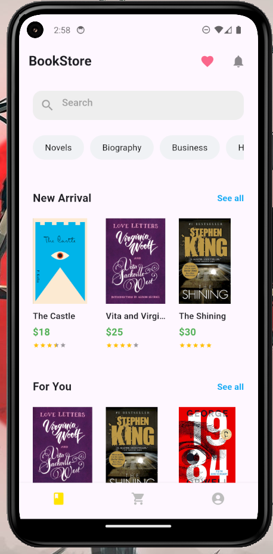
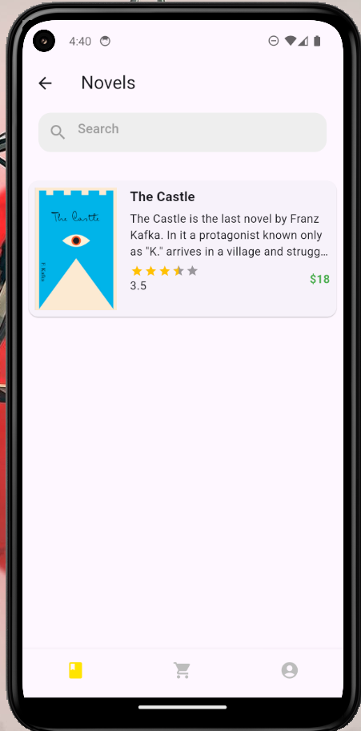
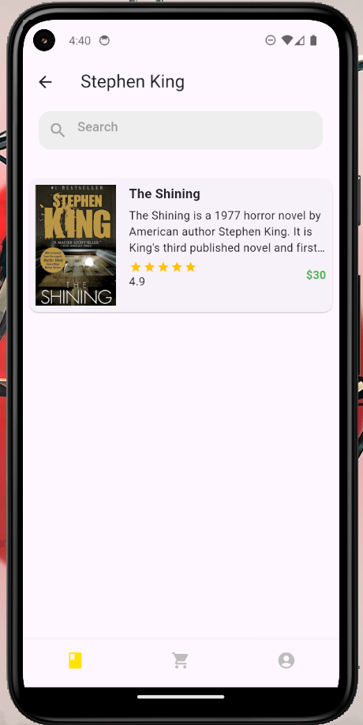
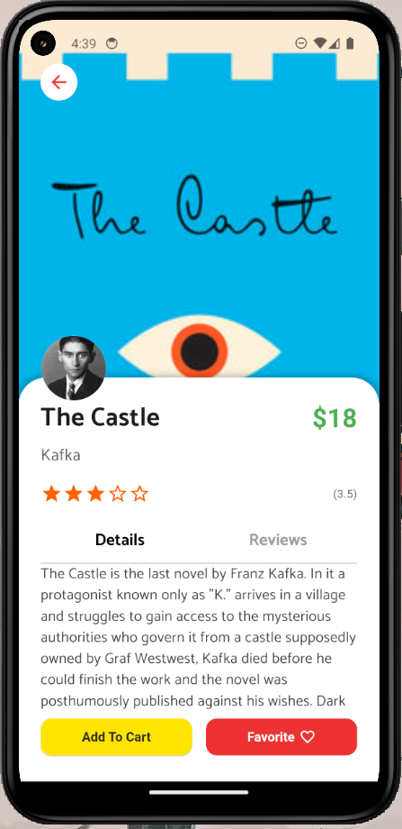
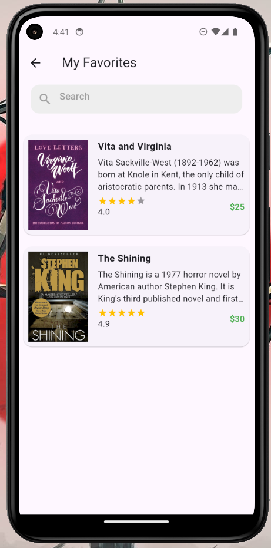
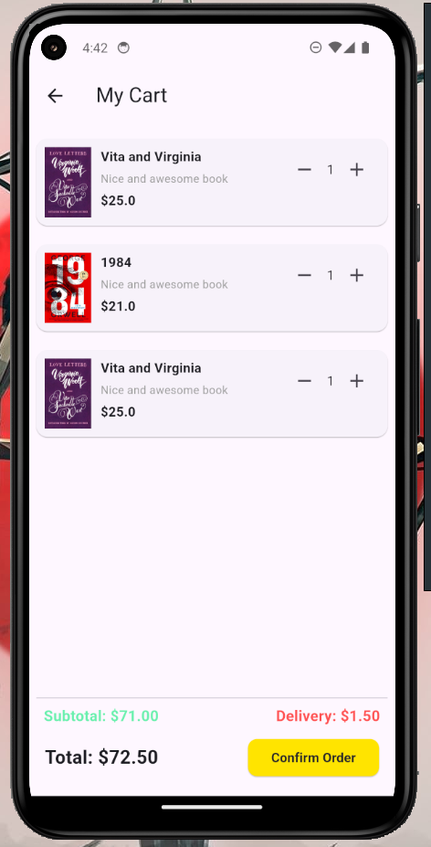
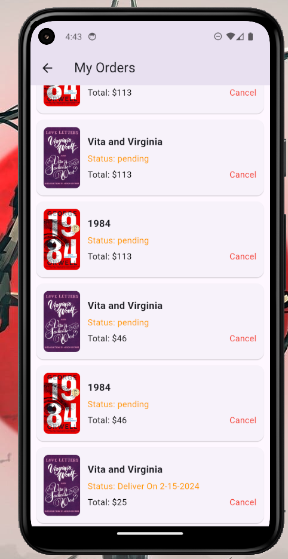
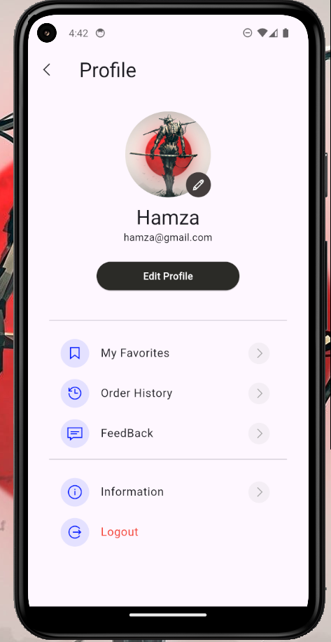
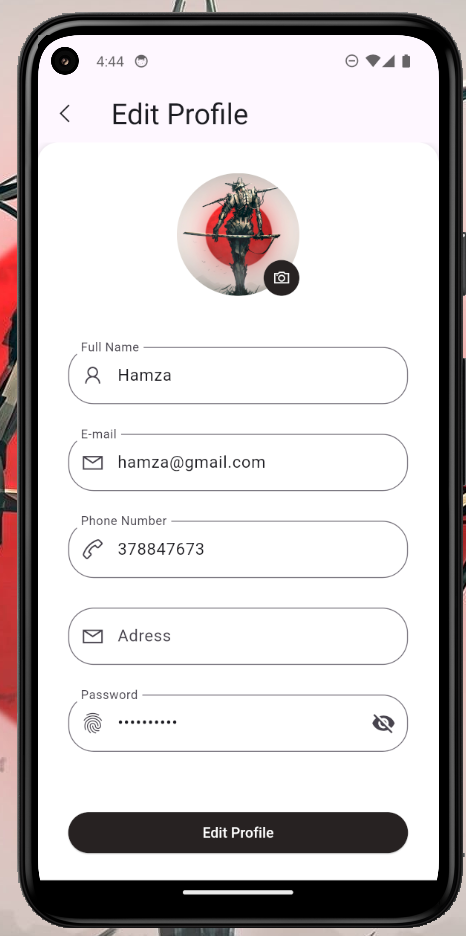
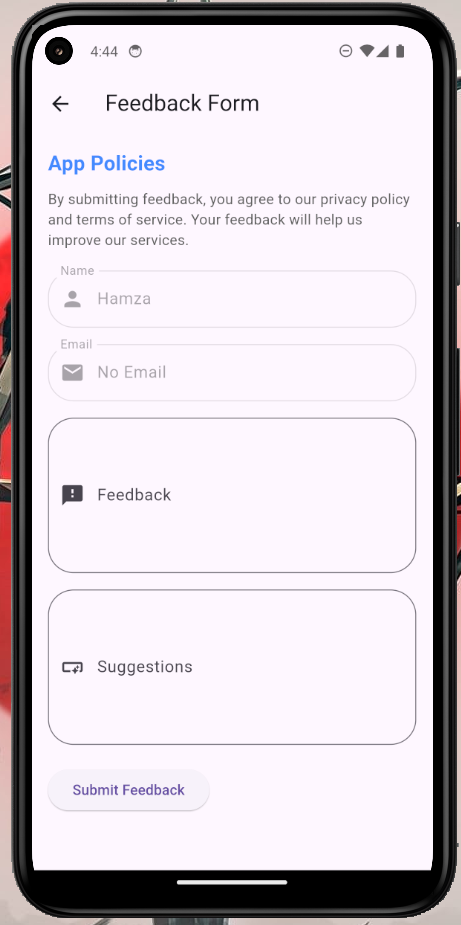

# 📚 Bookstore App

A complete **Bookstore Application** built using **Flutter (Frontend)** and **PHP with MySQL (Backend)**.  
It allows users to browse books, manage cart and orders, and securely authenticate using email and password.

---

## ✨ Key Features

### 👤 User Functionalities
- 🔐 **User Authentication**
  - Sign up / Login with secure credentials
  - Password hashing on server-side (PHP)
  - Token/session-based login handling

- 📚 **Browse & Discover Books**
  - Categories like Fiction, History, Self-help
  - Search books by title or author
  - View detailed info and high-res cover images

- 🛒 **Cart & Purchase Flow**
  - Add or remove items from cart
  - Real-time total calculation
  - Smooth checkout and order placement

- 📦 **Order Management**
  - Order confirmation screen
  - Order history with status (Pending, Shipped, Delivered)

- ⚙️ **User Profile**
  - View and update personal info
  - View all past orders
  - Secure logout and feedback submission

---

## 🛠 Tech Stack

| Layer      | Technology                     |
|------------|--------------------------------|
| Frontend   | Flutter (Dart), Provider/Bloc, Shared Preferences |
| Backend    | PHP (RESTful API), MySQL       |
| Security   | Password Hashing, Sessions / JWT |
| Database   | MySQL (PDO-based interaction)  |
| Storage    | Local storage with Shared Preferences |

---

🎥 **Video Demo:** [Watch Demo Video](https://github.com/Hamza-522/LabAutomation/blob/main/screenshots/demo.mp4)

## 🖼️ App Screenshots

### 🏠 Home & Browse

  
  
  

| 📌 Feature | 💬 Description |
|-----------|----------------|
| Home Page | New arrivals and book highlights |
| Category Page | Browse books by genre |
| Search by Author | Search and view books by author |

---

### 📘 Book Detail & Favorite

  
  
  

| 📌 Feature | 💬 Description |
|-----------|----------------|
| Book Detail | See full book info and cover |
| Favorites | Add books to saved list |
| Info Page | About app and team |

---

### 🛒 Shopping & Orders

  
  

| 📌 Feature | 💬 Description |
|-----------|----------------|
| Cart | Add/remove items, view total |
| Order Tracking | View order status/history |

---

### 👤 User & Feedback

  
  
  

| 📌 Feature | 💬 Description |
|-----------|----------------|
| User Profile | View personal details |
| Edit Profile | Change name, password, etc. |
| Feedback | Send feedback to admin |

---

## 🎥 Demo Video

  
> *(Click thumbnail to watch on YouTube)*

---

## 📂 How to Add Screenshots to Repo

1. Create a folder named `screenshots/` in your project root
2. Place all `.png` or `.jpg` images inside
3. Push the folder to GitHub (`git add screenshots/`, `commit`, `push`)
4. Make sure image links in README follow: `screenshots/filename.png`

---

## 🤝 Contributions

Feel free to open issues or submit pull requests to improve the project.  
For major changes, please open an issue first to discuss what you would like to change.

---

## 📬 Contact

For queries or feedback:

- 📧 Email: your.email@example.com  
- 📱 GitHub: [Your GitHub Profile](https://github.com/Hamza-522)

---

## ⭐ Like this project?

Please give a ⭐ on GitHub to show support!

